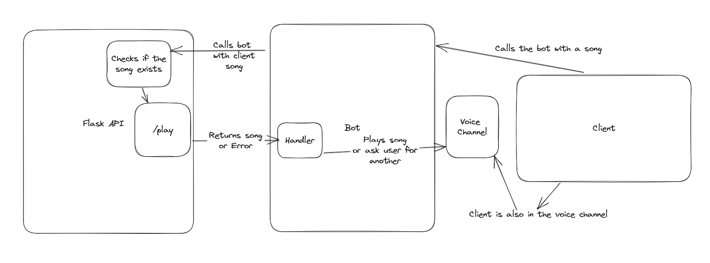

# Music Player

This api will be used for a discord bot I am working.

The only sort of functionality it will have for now is
- Search for songs
- Play songs

I don't know if I will update or upgrade this api as this is for a more personal use case.

## Architecture

